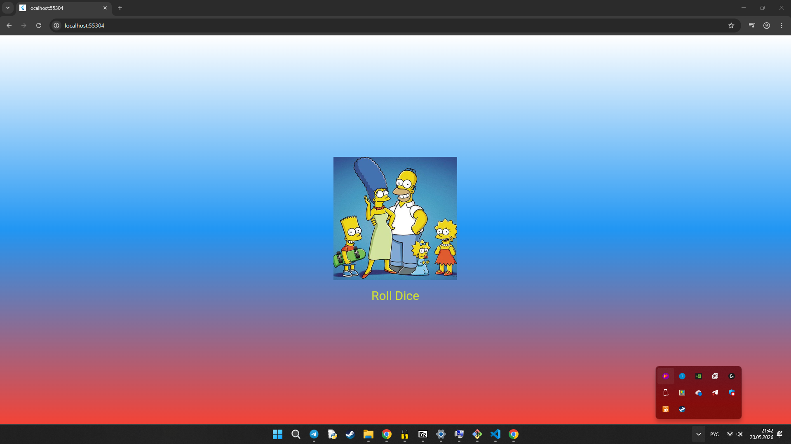

# Лабораторная работа №3
## Flutter: структура UI и компонентный подход

**Студент:** Березкин Роман, Зубрева Эля  

**Группа:** ИСП-233

**Дата сдачи:** 20.05.2026

---

## Что изучил в ходе работы

1. **Структуру UI в Flutter** — научился строить интерфейс через дерево виджетов (MaterialApp → Scaffold → Container → Column и т.д.)
2. **Создание собственных виджетов** — освоил вынесение UI в отдельные классы-виджеты (StatelessWidget и StatefulWidget)
3. **Разбиение кода на файлы** — понял, как организовать проект: каждый виджет в отдельном файле, импорты, правильная структура папок
4. **Работу с состоянием** — изучил разницу между StatelessWidget и StatefulWidget, научился использовать setState() для обновления UI
5. **Работу с ресурсами (assets)** — подключил изображения через pubspec.yaml и отобразил их в приложении
6. **Генерацию случайных чисел** — реализовал логику случайного выбора грани кубика при нажатии на кнопку

---

## Скриншот финального приложения



*Приложение с градиентным фоном, изображением игральной кости и кнопкой "Roll Dice"*

---

## Ссылка на репозиторий

https://github.com/pomarulit007-cyber/Flutter_Lab3

---

## Инструкция по запуску

### 1. Клонирование репозитория
```bash
https://github.com/pomarulit007-cyber/Flutter_Lab3.git
cd lab3
```

### 2. Установка зависимостей
```bash
flutter pub get
```
### 3. Запуск приложения
```bash
flutter run -d chrome
```

Или для запуска на конкретном устройстве:
```bash
flutter devices          
flutter run -d ...
```
### 4. Требования
- Flutter SDK 3.12.0 или выше

- Dart SDK 3.12.0 или выше

- Chrome (для веб-версии) или подключенный Android/iOS устройство

# Ответы на вопросы

## 1. Зачем выносить виджеты в отдельные файлы?

**Плюсы:**
- Улучшается читаемость кода
- Виджеты можно переиспользовать
- Проще поддерживать и тестировать
- Удобнее работать в команде

**Если всё в main.dart:**
- Файл становится огромным и нечитаемым
- Трудно находить нужные фрагменты
- Нет переиспользования
- Частые конфликты в Git

## 2. Что такое BuildContext?

BuildContext — это объект с информацией о позиции виджета в дереве.

**Что даёт:**
- Доступ к родительским виджетам
- Получение темы (Theme.of)
- Получение размеров экрана
- Навигацию между экранами

**Почему build() принимает BuildContext:**
Чтобы виджет знал, где он находится в дереве, какие данные доступны сверху и как взаимодействовать с другими виджетами.

## 3. StatelessWidget vs StatefulWidget

| StatelessWidget | StatefulWidget |
|----------------|----------------|
| Не хранит состояние | Хранит состояние |
| Не меняется после создания | Меняется через setState() |
| Легче и быстрее | Требует больше ресурсов |

**Пример StatelessWidget:** заголовок, иконка, кнопка с фиксированным текстом

**Пример StatefulWidget:** счётчик лайков, игральная кость, форма ввода, таймер

